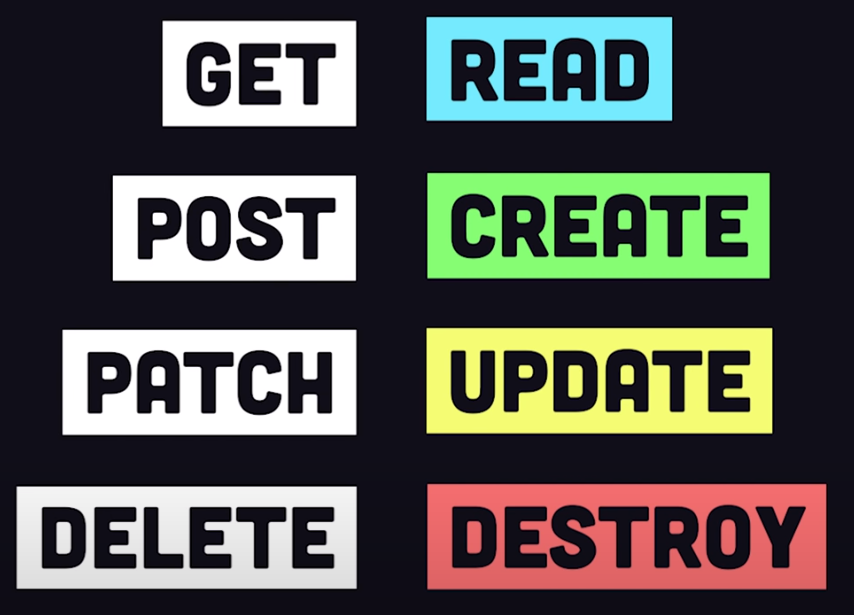

# RESTful APIs - Learning

# REST

## What is REST

REST is short for Representational State Transfer and is what most APIs in the world fall under

REST apis organize data/resoruces into unique URIs (Uniform Resource Identifiers) that differentiate different types of data resources on a server. Making a request to an endpoint over http.

### Type of Request
Here are some different types of requests


### Headers

### Body

### Types of Response

with Headers and Body as well

This archetecture is stateless. Each request response cycle is independent from all other communication. 


## Initializing an Express Server

its value is an import of the express package, which itself is a function, so we add paraenthsis 


```js
const app = require('express')();
const PORT = 8080;
// listens on port 8080 and fires a callback when ready with a print
app.listen(
  PORT,
  () => console.log(`it's alive on http://localhost:${PORT}`)
)
```