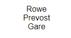

# React - Learning

# Introduction to JSX

[Learn React: JSX Cheatsheet | Codecademy](https://www.codecademy.com/learn/react-101/modules/react-101-jsx-u/cheatsheet)

```jsx
const h1 = <h1>Hello world</h1>;
```

is known as jsx. It's html in a js file

> JSX is a syntax extension for JavaScript. It was written to be used with React. JSX code looks a lot like HTML.

JSX is not readable as javescript by web browsers and must be compiled

### JSX Elements

```jsx
<h1>Hello world</h1>
```

this is a JSX element

JSX elements are treated as JavaScript expressions. They can go anywhere that JavaScript expressions can go.

> That means that a JSX element can be saved in a variable, passed to a function, stored in an object or array…you name it.

## JSX Attributes

JSX elements can have attributes, just like HTML elements can.

A single JSX element can have many attributes, just like in HTML:

```jsx
const panda = ;
```

## JSX Outer Elements

The first opening tag and the final closing tag of a JSX expression must belong to the same JSX element!

If you notice that a JSX expression has multiple outer elements, the solution is usually simple: wrap the JSX expression in a `<div></div>`.

## Rendering JSX

```jsx
import React from 'react';
import ReactDOM from 'react-dom';

ReactDOM.render(<h1>Hello world</h1>, document.getElementById('app'));
```

`ReactDOM.render()`‘s first argument should be a JSX expression, and it will be rendered to the screen.

You just learned that `ReactDOM.render()` makes its first argument appear onscreen. But where on the screen should that first argument appear?

The container element with the id below would be selected by `document.getElementById('container')`.

```jsx
<!DOCTYPE html>
<html lang="en">
<head>
	<meta charset="utf-8">
	<link rel="stylesheet" href="/styles.css">
	<title>Learn ReactJS</title>
</head>

<body>
  <span id="container"></span>
	<script src="https://content.codecademy.com/courses/React/react-course-bundle.min.js"></script>
  <script src="/app.compiled.js"></script>
</body>

</html>
```

self made example:

```jsx
import React from 'react';
import ReactDOM from 'react-dom';

// Write code here:
var myList = (
  <ul>
    <li>one</li>
    <li>two</li>
    <li>four</li>
  </ul>
);

ReactDOM.render(myList, document.getElementById('app'));
```

## The Virtual DOM

One special thing about `ReactDOM.render()` is that it *only updates DOM elements that have changed*.

```jsx
const hello = <h1>Hello world</h1>;
 
// This will add "Hello world" to the screen:
 
ReactDOM.render(hello, document.getElementById('app'));
 
// This won't do anything at all:
 
ReactDOM.render(hello, document.getElementById('app'));
```

## Self-Closing Tags

JSX requires them

```jsx
//Fine in JSX:
 
  <br />
 
//NOT FINE AT ALL in JSX:
 
  <br>
```

## Curly Braces in JSX

use curly braces to evaluate javascript in jsx

```jsx
ReactDOM.render(
  <h1>{2 + 3}</h1>,
  document.getElementById('app')
);
```

## Variables in JSX

When you inject JavaScript into JSX, that JavaScript is part of the same environment as the rest of the JavaScript in your file.

That means that you can access variables while inside of a JSX expression, even if those variables were declared on the outside.

```jsx
// Declare a variable:
const name = 'Gerdo';
 
// Access your variable 
// from inside of a JSX expression:
const greeting = <p>Hello, {name}!</p>;
```

## Event Listeners in JSX

JSX elements can have *event listeners*, just like HTML elements can. Programming in React means constantly working with event listeners.

You create an event listener by giving a JSX element a special *attribute*. Here’s an example:

```jsx

```

An event listener attribute’s *name* should be something like `onClick` or `onMouseOver`: the word `on`, plus the type of event that you’re listening for. You can see a list of valid event names [here](http://facebook.github.io/react/docs/events.html#supported-events).

```jsx
function myFunc() {
  alert('Make myFunc the pFunc... omg that was horrible i am so sorry');
}
 

```

Note that in HTML, event listener *names* are written in all lowercase, such as `onclick` or `onmouseover`. In JSX, event listener names are written in camelCase, such as `onClick` or `onMouseOver`.

## JSX Conditionals: If Statements That Don't Work

Great work! You’ve learned how to use curly braces to inject JavaScript into a JSX expression!

Here’s a rule that you need to know: you can not inject an `if` statement into a JSX expression.

This code will break:

```jsx
(
  <h1>
    {
      if (purchase.complete) {
        'Thank you for placing an order!'
      }
    }
  </h1>
)
```

What if you want a JSX expression to render, but only under certain circumstances? You can’t inject an `if` statement. What can you do?

You have lots of options. In the next few lessons, we’ll explore some simple ways to write *conditionals* (expressions that are only executed under certain conditions) in JSX.

```jsx
import React from 'react';
import ReactDOM from 'react-dom';

let message;

if (user.age >= drinkingAge) {
  message = (
    <h1>
      Hey, check out this alcoholic beverage!
    </h1>
  );
} else {
  message = (
    <h1>
      Hey, check out these earrings I got at Claire's!
    </h1>
  );
}

ReactDOM.render(
  message, 
  document.getElementById('app')
);
```

if.js works, because the words if and else are not injected in between JSX tags. The if statement is on the outside, and no JavaScript injection is necessary.

## JSX Conditionals: &&

We’re going to cover one final way of writing conditionals in React: the `&&` operator.

Like the ternary operator, `&&` is not React-specific, but it shows up in React surprisingly often.

`&&` works best in conditionals that will sometimes do an action, but other times do *nothing at all*.

Here’s an example:

## .map in JSX

```jsx
const people = ['Rowe', 'Prevost', 'Gare'];

const peopleLis = people.map(person =>
  // expression goes here:
  <li>{person}</li>
);

// ReactDOM.render goes here:
ReactDOM.render(<ul>{peopleLis}</ul>,document.getElementById('app'))
```



## Keys

A `key` is a JSX attribute. The attribute’s *name* is `key`. The attribute’s *value* should be something unique, similar to an `id` attribute.

`keys` don’t do anything that you can see! React uses them internally to keep track of lists. If you don’t use keys when you’re supposed to, React might accidentally scramble your list-items into the wrong order.

```jsx
const people = ['Rowe', 'Prevost', 'Gare'];

const peopleLis = people.map((person,i) =>
  // expression goes here:
  <li key={'person_' + i}>{person}</li>
);
```

## React.createElement

> You can write React code without using JSX at all!

The following JSX expression:

```jsx
const h1 = <h1>Hello world</h1>;
```

can be rewritten without JSX, like this:

```jsx
const h1 = React.createElement(
  "h1",
  null,
  "Hello, world"
);
```

---

## Hello World, Part II... THE COMPONENT

React applications are made out of components.

> A component is a small, reusable chunk of code that is responsible for one job. That job is often to render some HTML, which often involves rendering HTML.

This code will create and render a new React component:

```jsx
import React from 'react';
import ReactDOM from 'react-dom';
 
class MyComponentClass extends React.Component {
  render() {
    return <h1>Hello world</h1>;
  }
};
 
ReactDOM.render(
  <MyComponentClass />,
  document.getElementById('app')
);
```

On line 4, by subclassing `React.Component`, you create a new component class. This is not a component! A component class is more like a factory that produces components. When you start making components, each one will come from a component class.

```jsx
// creates a variable named React:
import React from 'react';
// creates a variable named ReactDOM:
import ReactDOM from 'react-dom';
// evaluates this variable and get a particular, imported JavaScript object:
React // { imported object properties here... }
```

The methods imported from `'react-dom'` are meant for interacting with the DOM. You are already familiar with one of them: `ReactDOM.render()`.

The methods imported from `'react'` don’t deal with the DOM at all. They don’t engage directly with anything that isn’t part of React.

All class components will have some methods and properties in common, thus `extends`

After we define our class component, we can use it to render as many instances of that component as we want.

Component Class names should be in UpperCamelCase

All JavaScript classes need a body.

Here’s what your class body would look like on its own, without the rest of the class declaration syntax. 

```jsx
{
  render() {
    return <h1>Hello world</h1>;
  }
}
```

This is a set of instructions explaining how to build a React component. 

So, let’s make a React component! It only takes one more line:

```jsx
<MyComponentClass />

```

To make a React component, you write a *JSX element.* Instead of naming your JSX element something like `h1` or `div` like you’ve done before, give it the same name as a *component class*. Voilà, there’s your *component instance!*

JSX elements can be either HTML-like, or component instances. JSX uses capitalization to distinguish between the two! That is the React-specific reason why component class names must begin with capital letters. In a JSX element, that capitalized first letter says, “I will be a component instance and not an HTML tag.”

---

# Use Multiline JSX in a Component

```jsx
import React from 'react';
import ReactDOM from 'react-dom';

class QuoteMaker extends React.Component {
  render() {
    return (
      <blockquote>
  <p>
    What is important now is to recover our senses.
  </p>
  <cite>
    <a target="_blank" 
      href="https://en.wikipedia.org/wiki/Susan_Sontag">
      Susan Sontag
    </a>
  </cite>
</blockquote>
      
    );
  }
};

ReactDOM.render(
  <QuoteMaker />,
  document.getElementById('app')
);
```

The render statement can work with multiline JSX if you add parentheses to the return statement in the `QuoteMaker` class.

## Use a Variable Attribute in a Component

Variables can be used within JSX to access values within a object's properties. 

```jsx
import React from 'react';
import ReactDOM from 'react-dom';

const owl = {
  title: 'Excellent Owl',
  src: 'https://content.codecademy.com/courses/React/react_photo-owl.jpg'
};

class Owl extends React.Component {
  render() {
    return (
      <div>
      <h1>{owl.title}</h1>
      
      </div>
    );
  }
}

ReactDOM.render(
  <Owl />,
  document.getElementById('app')
);
```

## Put Logic in a Render Function

A `render()` function must have a `return` statement but it's also a fine place to put simple calculations that need to happen right before a component renders. Here’s an example of some calculations inside of a `render` function:

```jsx
class Random extends React.Component {
  render() {
    // First, some logic that must happen
    // before rendering:
    const n = Math.floor(Math.random() * 10 + 1);
    // Next, a return statement
    // using that logic:
    return <h1>The number is {n}!</h1>;
  }
}
```

Make sure not to put the logic outside of the render function

```jsx
// WRONG
class Random extends React.Component {
  // This should be in the render function:
  const n = Math.floor(Math.random() * 10 + 1);
 
  render() {
    return <h1>The number is {n}!</h1>;
  }
};
```

## Use a Conditional in a Render Function

The `if` statement is located *inside* of the render function, but *before* the `return` statement. This is pretty much the only way that you will ever see an `if` statement used in a render function.

```jsx
import React from 'react';
import ReactDOM from 'react-dom';

const fiftyFifty = Math.random() < 0.5;

// New component class starts here:
class TonightsPlan extends React.Component {
  render() {
    let task;
    if (!fiftyFifty) {
      task = 'out'
    } else {
      task = 'to bed'
    }

    return <h1>Tonight I'm going {task} WOOO</h1>;
  }
}

ReactDOM.render(
	<TonightsPlan />,
	document.getElementById('app')
);
```

## Use `this` in a Component

From a background like Java, PHP or other *standard* language, `[this](https://en.wikipedia.org/wiki/This_(computer_programming))` is the instance of the current object in the class method. `this` cannot be used outside the method and such a simple approach does not create confusion.

In JavaScript the situation is different: `this` is the context of a function invocation (a.k.a. exection). The language has 4 function invocation types:

- function invocation: `alert('Hello World!')`
- method invocation: `console.log('Hello World!')`
- constructor invocation: `new RegExp('\\d')`
- indirect invocation: `alert.call(undefined, 'Hello World!')`

Each invocation type defines the context in its way, so `this` behaves differently than the developer expects.

[https://dmitripavlutin.com/gentle-explanation-of-this-in-javascript/](https://dmitripavlutin.com/gentle-explanation-of-this-in-javascript/)

```jsx
class IceCreamGuy extends React.Component {
  get food() {
    return 'ice cream';
  }
 
  render() {
    return <h1>I like {this.food}.</h1>;
  }
}
```

`this` refers to an instance of `IceCreamGuy`. The less simple answer is that `this` refers to the object on which `this`‘s enclosing method, in this case `.render()`, is called. It is almost inevitable that this object will be an instance of `IceCreamGuy`, but technically it could be something else.

Let’s assume that `this` refers to an instance of your component class, as will be the case in all examples in this course. `IceCreamGuy` has two methods: `.food` and `.render()`. Since `this` will evaluate to an instance of `IceCreamGuy`, `this.food` will evaluate to a call of `IceCreamGuy`‘s `.food` method. This method will, in turn, evaluate to the string “ice cream.”

Why don’t you need parentheses after `this.food`? Shouldn’t it be `this.food()`?

You don’t need those parentheses because `.food` is a *getter* method. You can tell this from the `get` in the above class declaration body.

There’s nothing React-specific about getter methods, nor about `this` behaving in this way! However, in React you will see `this` used in this way almost constantly.

## Use an Event Listener in a Component

Render functions often contain event listeners. Here’s an example of an event listener in a render function:

```jsx
render() {
  return (
    <div onHover={myFunc}>
    </div>
  );
}
```

[https://reactjs.org/docs/handling-events.html](https://reactjs.org/docs/handling-events.html)

> An event **handler** is a function that gets called in response to an event.

In React, you define event handlers as methods on a component class. Like this:

```jsx
class MyClass extends React.Component {
  myFunc() {
    alert('Stop it.  Stop hovering.');
  }
 
  render() {
    return (
      <div onHover={this.myFunc}>
      </div>
    );
  }
}
```

---

# Components Interact

A React application can contain dozens, or even hundreds, of components.

Each component might be small and relatively unremarkable on its own. When combined, however, they can form enormous, fantastically complex ecosystems of information.

In other words, React apps are made out of components, but what makes React special isn’t components themselves. What makes React special is the ways in which components *interact*.

Render methods can also return another kind of JSX: component instances.

```jsx
class OMG extends React.Component {
  render() {
    return <h1>Whooaa!</h1>;
  }
}
 
class Crazy extends React.Component {
  render() {
    return <OMG />;
  }
}
```

## Require A File

If you want to use a variable that’s declared in a different file, such as `NavBar`, then you have to *import* the variable that you want. To import a variable, you can use an `import` statement:

```jsx
import { NavBar } from './NavBar.js';
```

Notice the differences between the above line of code and this familiar line:

```jsx
import React from 'react';
```

The second important difference involves the contents of the string at the end of the statement: `'react'` vs `'./NavBar.js'`.

If you use an `import` statement, and the string at the end begins with either a dot or a slash, then `import` will treat that string as a *filepath*. `import` will follow that filepath, and import the file that it finds.

If your filepath doesn’t have a file extension, then “.js” is assumed. So the above example could be shortened:

```jsx
import { NavBar } from './NavBar';
```

## export

`export` comes from [ES6’s module system,](http://exploringjs.com/es6/ch_modules.html) just like `import` does. `export` and `import` are meant to be used together, and you rarely see one without the other.

There are a few different ways to use `export`.

Place the keyword `export` immediately before something that you want to export. That something can be any top-level `var`, `let`, `const`, `function`, or `class`. You can also export multiple things from the same file.

```jsx
// Manifestos.js:
 
export const faveManifestos = {
  futurist: 'http://www.artype.de/Sammlung/pdf/russolo_noise.pdf',
  agile: 'https://agilemanifesto.org/iso/en/manifesto.html',
  cyborg:   'http://faculty.georgetown.edu/irvinem/theory/Haraway-CyborgManifesto-1.pdf'
};

export const alsoRan = 'TimeCube';
```

In a different file, `import` the name of the `var`, `let`, `const`, `function`, or `class` from the first file:

```jsx
// App.js:
 
// Import faveManifestos and alsoRan from ./Manifestos.js:
import { faveManifestos, alsoRan } from './Manifestos';
 
// Use faveManifestos:
console.log(`A Cyborg Manifesto:  ${faveManifestos.cyborg}`); 
```

This style of importing and exporting in JavaScript is known as “named exports.” When you use named exports, you always need to wrap your imported names in curly braces, such as:

## Component Rendering In Action

```jsx
// ProfilePage.js

import React from 'react';
import ReactDOM from 'react-dom';
import { NavBar } from './NavBar.js';

class ProfilePage extends React.Component {
  render() {
    return (
      <div>
      <NavBar />
        <h1>All About Me!</h1>
        <p>I like movies and blah blah blah blah blah</p>
        
      </div>
    );
  }
}

ReactDOM.render(<ProfilePage />, document.getElementById('app'))
```

```jsx
// NavBar.js

import React from 'react';

export class NavBar extends React.Component {
  render() {
    const pages = ['home', 'blog', 'pics', 'bio', 'art', 'shop', 'about', 'contact'];
    const navLinks = pages.map(page => {
      return (
        <a href={'/' + page}>
          {page}
        </a>
      )
    });

    return <nav>{navLinks}</nav>;
  }
}
```

### Result


# Introduction to `this.props`

A component can pass information to another component.

Information that gets passed from one component to another is known as “props.”

## Access a Component's props

Every component has something called `props`.

A component’s `props` is an object. It holds information about that component.

To see a component’s `props` object, you use the expression `this.props`. Here’s an example of `this.props` being used inside of a render method:

```jsx
render() {
  console.log("Props object comin' up!");
 
  console.log(this.props);
 
  console.log("That was my props object!");
 
  return <h1>Hello world</h1>;
}
```

```jsx
import React from 'react';
import ReactDOM from 'react-dom';

class PropsDisplayer extends React.Component {
  render() {
  	const stringProps = JSON.stringify(this.props);

    return (
      <div>
        <h1>CHECK OUT MY PROPS OBJECT</h1>
        <h2>{stringProps}</h2>
      </div>
    );
  }
}

// ReactDOM.render goes here:
ReactDOM.render(
	<PropsDisplayer />,
	document.getElementById('app')
);

```

---

# useState supplementary material 

[https://www.youtube.com/watch?v=O6P86uwfdR0](https://www.youtube.com/watch?v=O6P86uwfdR0)

---